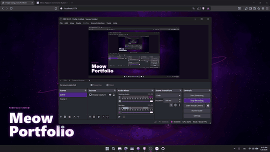

# Meow Astral Core

**Meow Astral Core** is a cinematic WebGL / Three.js hero scene built for an immersive personal portfolio. The visual direction combines a purple astral core, a fractured armillary sphere, feng-shui compass-inspired orbit bands, ancient relic damage, floating debris, plasma haze, and black-hole energy distortion.

This project is designed as a serious portfolio-grade visual system: reusable, responsive, interactive, and suitable as a fullscreen background for a bio page, landing page, or creative developer profile.

## Preview



<p>
  <video
    src="assets/preview.mp4"
    poster="assets/preview-poster.jpg"
    controls
    muted
    playsinline
    width="100%"
  >
    Your browser does not support the video tag.
  </video>
</p>

- Inline animated preview: [assets/preview.gif](assets/preview.gif)
- Lightweight README preview: [assets/preview.mp4](assets/preview.mp4)
- Full-quality review video: [assets/review.mp4](assets/review.mp4)
- Local development URL: `http://localhost:5173/`

The README uses a compressed animated preview and a lightweight video file so reviewers can see the scene directly on GitHub. The original full-quality recording is still available in `assets/review.mp4`.

README dùng bản GIF preview nhẹ và một video MP4 nhẹ để người xem có thể xem trực tiếp trên GitHub. Bản quay chất lượng đầy đủ vẫn được giữ trong `assets/review.mp4`.

## Highlights

- Real-time 3D scene powered by React, Vite, Three.js, and React Three Fiber.
- Ancient armillary-inspired orbital rings with cracks, broken sections, impact marks, floating shards, and worn bronze material.
- Purple energy core with wireframe glow, halo layers, bloom, chromatic aberration, and cinematic camera motion.
- Particle fields, foreground dust, accretion disk motion, nebula plasma background, and black-hole style visual tension.
- Pointer-reactive interaction system for resonance, surge, and camera movement.
- Config-driven tuning for colors, bloom, camera, particles, ring motion, and core distortion.

## Tech Stack

- React 19
- TypeScript
- Vite
- Three.js
- React Three Fiber
- Drei
- Postprocessing

## Run Locally

```bash
npm install
npm run dev
```

Build production files:

```bash
npm run build
```

Preview the production build:

```bash
npm run preview
```

## Main Files

- `src/App.tsx` - fullscreen canvas, camera rig, interaction driver, and hero text.
- `src/config/sceneConfig.ts` - colors, camera, bloom, particles, accretion disk, and scene tuning.
- `src/config/interactionState.ts` - shared pointer and motion state.
- `src/components/Rings.tsx` - fractured armillary / compass orbit system.
- `src/components/EnergyCore.tsx` - glowing astral core, shader distortion, halo, and wireframe shell.
- `src/components/AccretionDisk.tsx` - spiral disk particles around the singularity.
- `src/components/ContainmentMesh.tsx` - energy cage around the core.
- `src/components/PlasmaBackground.tsx` - shader-based nebula and plasma field.
- `src/components/ForegroundDust.tsx` - near-camera dust for depth and scale.
- `src/components/Particles.tsx` - orbiting cosmic particles.
- `src/components/PostProcessing.tsx` - bloom, chromatic aberration, and vignette.

## Vietnamese Description

**Meow Astral Core** là một cảnh nền 3D WebGL được xây dựng cho portfolio cá nhân theo hướng điện ảnh, huyền bí và có chiều sâu thị giác. Dự án lấy cảm hứng từ lõi năng lượng vũ trụ, hố đen, hỗn thiên nghi, la bàn phong thủy, kiến trúc cổ bị bào mòn, các vòng quỹ đạo nứt vỡ và mảnh vụn bay lơ lửng xung quanh lõi.

Mục tiêu của dự án là tạo ra một background 3D nghiêm túc, có thể dùng cho bio page hoặc portfolio khi đi thực tập, tốt nghiệp, ứng tuyển hoặc xây dựng thương hiệu cá nhân.

## Điểm Nổi Bật

- Cảnh 3D real-time dùng React, Vite, Three.js và React Three Fiber.
- Các vòng quỹ đạo lấy cảm hứng từ hỗn thiên nghi và la bàn cổ, có chi tiết nứt, bể, mẻ cạnh, biến dạng và mảnh vỡ.
- Lõi năng lượng tím với hiệu ứng glow, wireframe, halo, bloom và chuyển động camera điện ảnh.
- Hệ particle, bụi vũ trụ, đĩa bồi tụ, nền plasma và cảm giác lực hút kiểu hố đen.
- Tương tác theo chuyển động chuột để tạo cảm giác sống động khi dùng làm nền web.
- Cấu hình tập trung trong `sceneConfig.ts`, dễ tinh chỉnh màu sắc, tốc độ, độ sáng và mật độ hiệu ứng.

## Author

Created and owned by **Meow**.

## Copyright

Copyright (c) 2026 Meow. All rights reserved.

This source code, visual design, scene composition, and related assets are owned by Meow. You may view the repository for portfolio evaluation, learning, and review purposes. Reuse, redistribution, resale, or claiming ownership of this project is not permitted without written permission from Meow.
